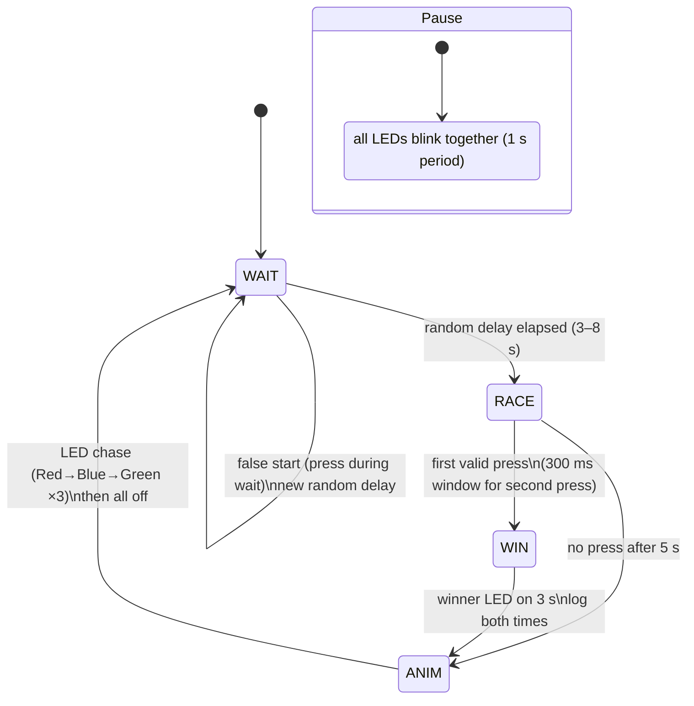

# Reflex Duel Game — Specification

## 1. Goal

Two players race to press their own button the moment a Start LED lights.
The first valid press wins; both players' reaction times are measured, and
winners/history are available over the ChibiOS shell and a web dashboard.
All peripherals (LEDs, buttons, OLED) are external to the Nucleo board.

## 2. Hardware

Target: STM32G474RE Nucleo-64 (Cortex-M4F), ChibiOS/RT 21.11.x.

### 2.1 Pin assignment (Arduino header, defaults)

| Signal            | GPIO | Arduino | Direction | Active level |
|-------------------|------|---------|-----------|--------------|
| Start LED (Red)   | PB6  | D10     | out       | high         |
| Winner 1 (Blue)   | PC7  | D9      | out       | high         |
| Winner 2 (Green)  | PA6  | D12     | out       | high         |
| Player 1 button   | PB10 | D6      | in        | low (pull-up)|
| Player 2 button   | PA7  | D11     | in        | low (pull-up)|
| OLED SCL (I2C1)   | PB8  | D15     | alt (AF4) | —            |
| OLED SDA (I2C1)   | PB9  | D14     | alt (AF4) | —            |

- LEDs: driven push-pull through an external series resistor to GND.
- Buttons: external switch to GND, internal pull-up, falling-edge EXTI.
  PB10 → EXTI10, PA7 → EXTI7 (independent lines, no shared-EXTI conflict).
- OLED: SSD1306 128×64 I2C, address `0x3C`, 400 kHz, 3.3 V.

All pins verified against `docs/board/SC STM32G474RE Nucleo64 C04.pdf`
(schematic sheet 5, Arduino extension connector).

### 2.2 On-board resources used

- `SD2` (USART2, PA2/PA3, AF7) — ChibiOS shell, 38400 baud (ST-Link VCP).
- SysTick (RT system time) — reaction-time measurement.
  - `CH_CFG_ST_FREQUENCY = 10000` → 100 µs/tick resolution.
  - Timestamps via `chVTGetSystemTimeX()`; elapsed = `TIME_I2US(diff)`.
- `TRNGD1` (RNG) — random wait interval.
- `I2CD1` (I2C1, PB8/PB9) — SSD1306 OLED.

## 3. Functional behavior

### 3.1 States

- **WAIT**: all LEDs off. A random delay (3–8 s, hardware TRNG) is pending.
  Any button press during WAIT is a false start: the round is abandoned and a
  new random delay is generated (game resets, no disqualification).
- **RACE**: when the delay elapses, the Start LED turns on immediately and the
  start timestamp is captured (`chVTGetSystemTimeX()`). The first valid press
  wins; a 300 ms window after the first press captures a near-simultaneous
  second press so both reaction times are recorded.
- **WIN**: the winner LED (Blue = P1, Green = P2) turns on immediately and
  stays on for 3 s. Both press times are logged (`none` if a player never
  pressed).
- **ANIM**: short LED animation marking the transition to the next round, then
  back to WAIT with a new random delay.
- **Pause** (shell command): the game freezes and all three LEDs blink together
  at a 1 s period until paused again.

### 3.2 Interrupt / timing semantics

- Both buttons are armed with PAL callbacks on the falling edge (EXTI).
- Each press records that player's reaction time independently (`g_t1`/`g_t2`),
  from the shared start stamp. The first press sets the winner.
- Reaction time = elapsed system ticks converted to µs. 100 µs resolution is
  sufficient for human reflexes (~150–300 ms).

### 3.3 Close-call animation

Suspense is always on. After the first press, a 300 ms window waits for a
second press. If both players pressed and their reaction times are within
`CLOSE_THRESHOLD_US` (50000 µs = 50 ms) of each other, the `CLOSE ONE!` screen
and the LED chase play before the winner is revealed.

### 3.4 OLED display

Screens rendered from the game thread at each state transition:

- **Splash**: 32×32 bitmap logo + "REFLEX DUEL".
- **WAIT**: "GET READY".
- **RACE**: "GO!".
- **WIN**: "P1 WINS!" / "P2 WINS!", winner time in large 16×24 digits,
  both players' times (`none` if absent).
- **Pause**: "PAUSED".
- **Close call**: "CLOSE ONE!".

### 3.5 Edge cases

- **False start** (press during WAIT): round resets, new random delay.
- **No press** during RACE after 5 s: round aborts, animation, back to WAIT.
- **Simultaneous press**: first press wins; second press is still recorded
  within the 300 ms window.

## 4. Shell interface

Prompt: `reflex> `. Standard commands are disabled.

| Command | Output |
|---------|--------|
| `log`   | Table: `# | Winner | P1 [us] | P2 [us]` (last 16 rounds, `none` for absent) |
| `points`| `Player 1: N wins` / `Player 2: N wins` (cumulative) |
| `pause` | Toggles pause (LEDs blink together at 1 s while paused) |

## 5. Dashboard

`dashboard/` — Next.js + Tailwind app communicating over Web Serial
(ST-Link VCP, 38400 baud). Polls `points` and `log`, showing wins, win rates,
close-call count, best/average reaction times, a win-distribution bar and a
recent-rounds table. Includes a Pause/Resume button.

## 6. Build configuration deltas

Relative to the NUCLEO64-G474RE demo defaults:

| File | Setting | Value |
|------|---------|-------|
| `cfg/halconf.h` | `HAL_USE_TRNG` | `TRUE` |
| `cfg/halconf.h` | `HAL_USE_I2C` | `TRUE` |
| `cfg/halconf.h` | `HAL_USE_SERIAL` | `TRUE` (shell) |
| `cfg/mcuconf.h` | `STM32_TRNG_USE_RNG1` | `TRUE` |
| `cfg/mcuconf.h` | `STM32_I2C_USE_I2C1` | `TRUE` |
| Makefile | `shell.mk` + `streams.mk` | included |
| Makefile | `oled.c` | included |
| Makefile | test suites (`test.mk`, `rt_test.mk`, `oslib_test.mk`) | removed |

Clock assumptions (from mcuconf): HSI48 (48 MHz) feeds the RNG — meets the RNG
clock assert (47–49 MHz). No GPT/timer peripheral required; timing uses the RT
system tick (SysTick).

## 7. Coding style

ChibiOS general style: K&R braces, 2-space indent, no tabs, LF endings, terse
lowercase for HAL-level code.
